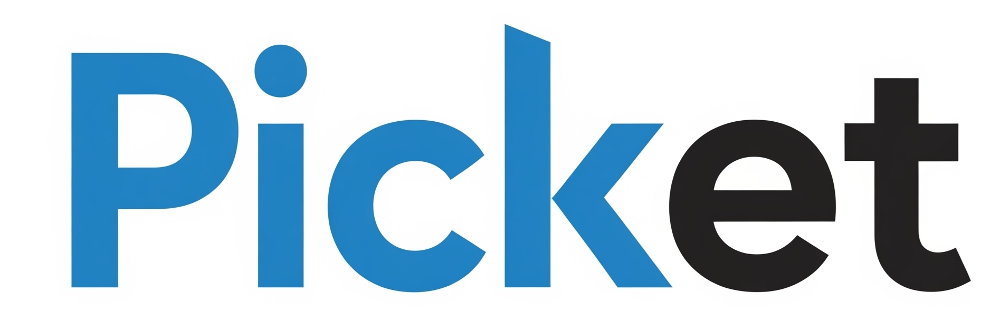
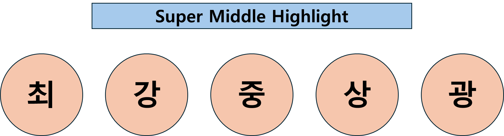

# be17-3rd-Picketnologia-Picket

 <h1 align="center">🎟️ Picket </h1>

  
  
<h3 align="center">1팀 - Picketnologia</h3>

  

# 👨‍💻 팀원 구성

<table align="center">
  <tr>
  
  

  </tr>
  <tr>
    <td align="center">
      <b>최경민</b> 
    </td>
    <td align="center">
      <b>강설</b> 
    </td>
    <td align="center">
      <b>김원중</b> 
    </td>
    <td align="center">
      <b>이상우</b> 
    </td>
    <td align="center">
      <b>김광호</b> 
    </td>
  </tr>
</table>
  

# 프로젝트 주소

[www.picket.o-r.kr](https://www.picket.o-r.kr)

# 프로젝트 소개

최근 공연, 전시, 스포츠 이벤트에 대한 관심이 높아지면서 예매 플랫폼의 수요도 빠르게 증가하고 있습니다. 기존 플랫폼들은 관심사 기반 알림, 대기열 시스템, 장애 복구 기능, QR 기반 티켓 제공 등을 통해 안정적인 예매 경험을 제공합니다.

Picket은 공연 예매 플랫폼으로, 판매자가 직접 공연을 등록하고 관리할 수 있으며, 사용자들은 좌석 정보를 실시간으로 확인하고 공유할 수 있는 기능을 제공합니다. 이를 통해 공연 정보와 좌석 현황을 신속하고 투명하게 제공하여, 사용자와 판매자 모두에게 편리하고 효율적인 공연 예매 경험을 제공합니다.

### 주요 특징

- **판매자 중심 등록 기능** : 공연 정보와 좌석을 직접 등록하고 관리 가능
- **실시간 좌석 공유** : 사용자가 좌석 상황을 실시간으로 확인하고 공유 가능
- **투명하고 빠른 정보 제공** : 공연 정보와 좌석 현황을 즉시 반영

# 기술 스택

## 🔎 핵심 기능

[핵심 기능]()
 
 

## ⚙ 기능 테스트

[기능 테스트]()
 
 

## ⚙ 성능 개선

[성능 개선](https://github.com/beyond-sw-camp/be17-3rd-Picketnologia-Picket/wiki/%EC%84%B1%EB%8A%A5%EA%B0%9C%EC%84%A0)
 
 

## 🔗 Swagger

[Swagger](https://api.picket.o-r.kr/swagger-ui/index.html#/)
 
 

## 🛠 시스템 아키텍처

[시스템 아키텍처](https://github.com/beyond-sw-camp/be17-3rd-Picketnologia-Picket/wiki/3.-%EC%8B%9C%EC%8A%A4%ED%85%9C-%EC%95%84%ED%82%A4%ED%85%8D%EC%B2%98)
 
 

## 📡 소프트웨어 아키텍처

[소프트웨어 아키텍처](https://github.com/beyond-sw-camp/be17-3rd-Picketnologia-Picket/wiki/2.-%EC%86%8C%ED%94%84%ED%8A%B8%EC%9B%A8%EC%96%B4-%EC%95%84%ED%82%A4%ED%85%8D%EC%B2%98#%EC%86%8C%ED%94%84%ED%8A%B8%EC%9B%A8%EC%96%B4-%EC%95%84%ED%82%A4%ED%85%8D%EC%B2%98-%EA%B5%AC%EC%84%B1)
 
